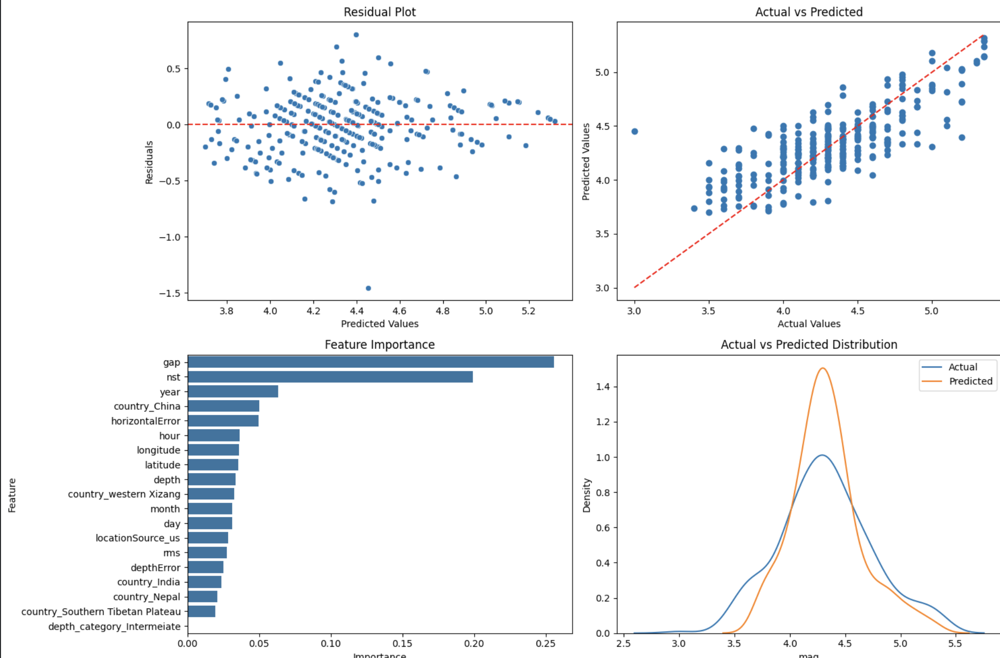

# 🌍 Nepal Earthquake Magnitude Predictor



[](https://earthquakeprediction-by-sourabh.streamlit.app/)

---

I built this project because earthquake prediction is one of those problems where machine learning can actually matter — not just academically, but in terms of real impact. Nepal sits on one of the most seismically active zones in the world. The 2015 Gorkha earthquake alone killed nearly 9,000 people. I wanted to understand what patterns exist in historical seismic data and whether a model could learn to estimate magnitude from measurable parameters.

So I took earthquake data from 1990 to 2026, cleaned it properly, engineered features from it, tested multiple models, and ended up with a tuned XGBoost regressor as the final model — deployed as a live Streamlit app.

---

## Live App

🔗 **[Open QuakeSense →](https://earthquakeprediction-by-sourabh.streamlit.app/)**

---

## What the Model Predicts

Given seismic station readings and geographic inputs, the model predicts the **Richter scale magnitude** of an earthquake. It's a regression task — not classification. The output is a continuous magnitude value which the app then maps to a severity label (Minor / Light / Moderate / Strong / Major).

---
# 📂 Dataset Information

The dataset contains seismic and geographical earthquake information.
Sources Kaggle - 🔗 **[Dataset Link](https://www.kaggle.com/datasets/amansinghnp/nepal-earthquake-seismicity-dataset-1990-2026)**

---

## The Journey — What Actually Happened

### Data Cleaning First

The raw dataset had a lot of issues:

- `id`, `type`, `status`, `updated`, `magError`, `magNst` — dropped (no predictive value or potential leakage)
- `time` column — converted to datetime and extracted `year`, `month`, `day`, `hour`
- `place` column — parsed to extract `country` name from the end of messy text strings
- `dmin` — dropped due to too many missing values
- Missing values in `nst`, `depthError` filled with **median** (skewed features)
- Missing values in `gap`, `rms`, `horizontalError` filled with **mean**
- `country` values cleaned — fixed `2025 Southern Tibetan Plateau Earthquake` → `Southern Tibetan Plateau`, unified inconsistent spellings
- Added `depth_category` feature: Shallow (0–70km) / Intermediate (70–300km) / Deep (300–700km)

### Feature Engineering

- Extracted temporal features from timestamp: `year`, `month`, `day`, `hour`
- Parsed country from `place` text field
- Created `depth_category` from continuous depth
- Dropped leakage columns: `magType`, `magSource`, `net` variants — these are assigned after an earthquake is measured, not before
- Dropped high-cardinality or near-zero-importance features
- Final feature set: **19 features**

### Models Trained

Started with a baseline and worked up:

| Model | Notes |
|-------|-------|
| Linear Regression | Baseline — weak performance |
| Naive Bayes | Not suited for regression |
| KNN Regressor (k=8) | Decent but slow |
| SVR | Slow, similar to KNN |
| Decision Tree | Overfit easily |
| Random Forest | Better generalization |
| XGBoost (base) | Best base model |

#  Final Model -> ##  XGBoost Regressor

- Better generalization
- Strong nonlinear learning capability
- Robust performance on structured data
- Stable test performance

### Hyperparameter Tuning

Used `RandomizedSearchCV` with 5-fold CV on XGBoost across a large grid:

```python
xgb_grid = {
    'n_estimators'    : [100, 200, 500],
    'learning_rate'   : [0.01, 0.05, 0.1],
    'max_depth'       : [3, 4, 5, 6, 7],
    'min_child_weight': [1, 3, 5],
    'subsample'       : [0.7, 0.8, 1.0],
    'colsample_bytree': [0.7, 0.8, 1.0],
    'gamma'           : [0, 0.1, 0.3],
}
```

Best params: `colsample_bytree=0.7, gamma=0.1, learning_rate=0.1, max_depth=5, n_estimators=500`

Also ran cross-validation on the final model to verify generalization.

---

## Project Structure

```
earthquake_prediction/
├── app.py                      # Streamlit UI
├── xgb_tune.pkl                # Trained XGBoost model
├── feature_columns.pkl         # Feature column names (19 features)
├── requirements.txt            # Dependencies
├── nepal_earrthquakes.ipynb    # Full notebook — EDA to deployment
└── README.md
```

---

## Features Used by the Model

| Feature | Description |
|---------|-------------|
| `latitude` | Geographic latitude of epicenter |
| `longitude` | Geographic longitude of epicenter |
| `depth` | Depth of earthquake in km |
| `nst` | Number of seismic stations that reported the event |
| `gap` | Largest azimuthal gap between stations (degrees) |
| `rms` | Root mean square of travel-time residuals |
| `horizontalError` | Uncertainty in horizontal location (km) |
| `depthError` | Uncertainty in depth measurement (km) |
| `year`, `month`, `day`, `hour` | Temporal features extracted from timestamp |
| `locationSource_us` | Whether USGS was the location source |
| `country_*` | One-hot encoded country (Nepal, China, India, etc.) |
| `depth_category_Intermediate` | Whether depth is in intermediate range |

---


## Tech Stack

- **Python 3**
- **Pandas, NumPy** — data cleaning, feature engineering
- **Matplotlib, Seaborn** — EDA visualizations
- **Scikit-learn** — multiple models, train-test split, RandomizedSearchCV
- **XGBoost** — final model
- **Pickle** — model serialization
- **Streamlit** — live web app

---

## What I Learned
The most interesting part of this project was feature leakage. magType and magSource columns seem like useful features — they describe how the magnitude was measured. But they're assigned after the earthquake is recorded, not before. Including them would give the model information it couldn't possibly have at prediction time. Dropping them was the right call, even though it reduced performance slightly.
The second lesson was that depth matters more than I expected. Shallow earthquakes (under 70km) behave very differently from deep ones. Creating depth_category as an explicit feature helped the model learn this boundary more cleanly than raw depth alone.

Author
Sourabh Vishwakarma
LinkedIn - www.linkedin.com/in/sourabh9098
GitHub - https://github.com/sourabh9098/
